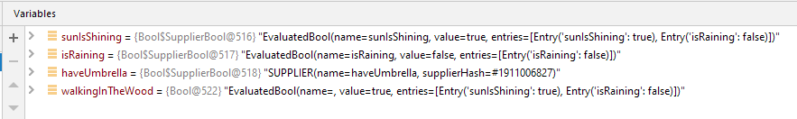

# KBool

[](https://travis-ci.org/xeroli/kbool) [](http://www.apache.org/licenses/LICENSE-2.0)
## Summary

**KBool** is a simple kotlin library providing a transparent boolean algebra.

The reason for the development of this library was an application that was too complex 
to understand at any time why some actions were not executable at a time.

So the question was:

Wouldn't it be nice if you just implement the conditions for disabling the buttons as usual and something would automatically return the resulting boolean value including the responsible subconditions. 
A tooltip for disabled buttons would then explain the reason for the missing functionality.

Basically, one is always looking for the answer to the question: Which part of a condition is currently not fulfilled?

This is what **KBool** tries to reach.

### Code example
```kotlin
val sunIsShining = true.asBool("sun is shinig?")
val isRaining = false.asBool().named("is raining?")
val haveUmbrella = true.asBool("have umbrella?")

val walkingInTheWood = sunIsShining and (!isRaining or haveUmbrella)

println(walkingInTheWood.isTrue())   // -> true, but why?
println(walkingInTheWood.getCause()) // -> sun is shining? - true, is raining - false
                                     //    so an umbrella doesn't change a thing today ;-)
```

And even if you are **not** using the cause in your application, 
the debugger shows it. :blush:



## Latest Stable Release

#### Download

[  ](https://bintray.com/xeroli/maven/kbool/_latestVersion)

#### Maven
```xml
...
<repositories>
  <repository>
    <id>jcenter</id>
    <url>https://jcenter.bintray.com/</url>
  </repository>
</repositories>

<dependencies>
  <dependency>
    <groupId>de.xeroli.kbool</groupId>
    <artifactId>kbool</artifactId>
    <version>0.3.0</version>
  </dependency>
</dependencies>
...
```

#### Gradle
```groovy
repositories {
  jcenter()
}

dependencies {
  compile('de.xeroli.kbool:kbool:0.3.0')
}
```

## Snapshot

[](https://travis-ci.com/xeroli/kbool)

You can access the latest snapshot by adding "-SNAPSHOT" to the version number and
adding the repository `https://oss.jfrog.org/artifactory/oss-snapshot-local`
to your build.

You can also reference a specific snapshot like `0.2.0-20200125.081709-1`. 
Here's the [list of snapshot versions](https://oss.jfrog.org/webapp/#/artifacts/browse/tree/General/oss-snapshot-local/de/xeroli/kbool/kbool).

The sourcecode of snapshots are in the branch named ['snapshot'](https://github.com/xeroli/kbool/tree/snapshot).
#### Maven
```xml
...
<repositories>
  <repository>
    <id>oss-snapshot-local</id>
    <url>https://oss.jfrog.org/webapp/#/artifacts/browse/tree/General/oss-snapshot-local/de/xeroli/kbool/kbool</url>
  </repository>
</repositories>

<dependencies>
  <dependency>
    <groupId>de.xeroli.kbool</groupId>
    <artifactId>kbool</artifactId>
    <version>0.4.0-SNAPSHOT</version>
  </dependency>
</dependencies>
...
```

#### Gradle
```groovy
repositories {
  maven { url 'https://oss.jfrog.org/artifactory/oss-snapshot-local' }
}

dependencies {
  compile('de.xeroli.kbool:kbool:0.4.0-SNAPSHOT')
}
```


